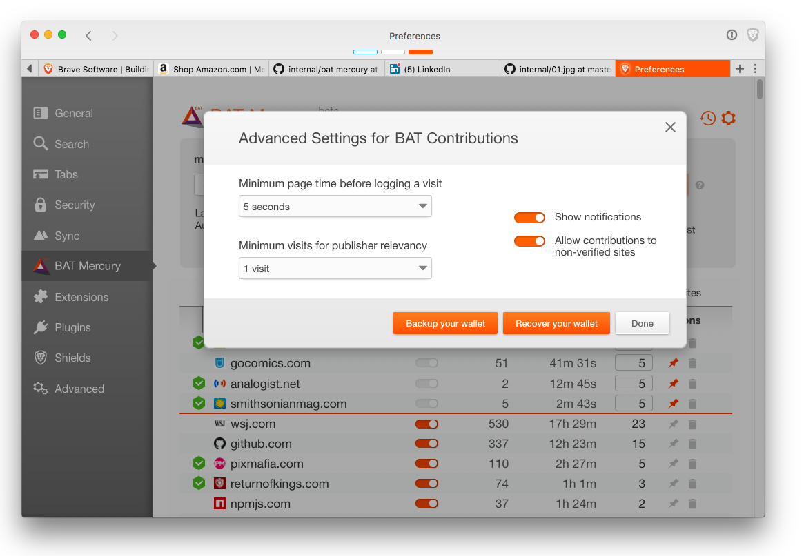
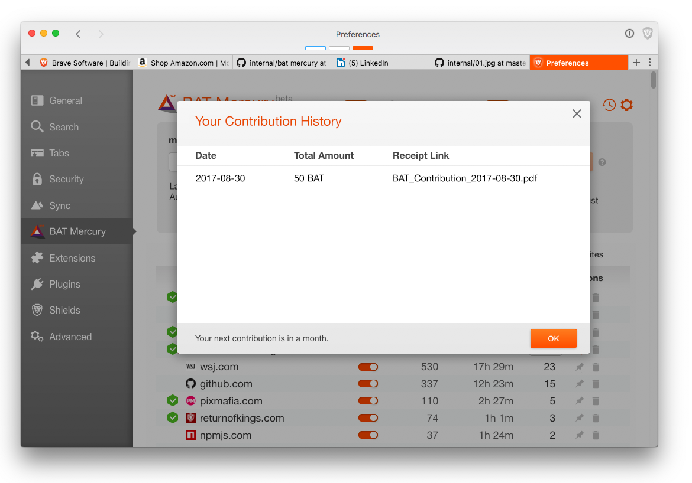

# BAT Mercury Concept [revision 2017-08-01-A]
This repository shows the initial design concept for the "Mercury" phase of BAT integration.
Consult [the roadmap](https://basicattentiontoken.org/bat-roadmap-1-0/) for a description of the phases of BAT integration.
Note that the term "BAT Mercury" is a placeholder in the images below.
Further note that this repository is a "snapshot" of our current design thinking,
which will inevitably change during implementation of, and experience with, the BAT integration.

The launch of BAT Mercury has two interrelated goals:

- Integrate a BAT wallet into the Brave browser

- Convert Contributions from Bitcoin to BAT

A Bitcoin proof-of-concept is present in the Brave browser,
which has proven invaluable for understanding many of the issues associated with attention-based contribution systems.

In addition to the BAT Mercury launch,
in order to fit with Brave Software's development cycle,
two BAT Mercury "refresh" releases are also planned.
After the final "refresh: release,
we hope to have BAT support that is better than what is in the Bitcoin proof-of-concept.

From the Brave browser's perspective,
there are three areas of interest:

- Onboarding (creating a BAT wallet in the Brave browser)

- Attention Synopsis (keeping track of your browsing attention)

- Contributions

 From the publisher-perspective,
the primary area of interest is onboarding.

## Browser Onboarding

When BAT Mercury launches,
the BAT [user growth pool](https://basicattentiontoken.org/faq/#UGP) is used to initially fund the BAT wallet in the
Brave browser.

The subsequent BAT Mercury "refresh" releases will allow you to directly fund their BAT wallet in their Brave browser,
and to "upgrade" the BAT wallet to bi-directional status -- allowing them to make withdrawals from the wallet.
Please note that the wallet provider is required to identify you, the person using the browser -- "know your customer"
regulations apply.

Different wallet integration architectures are being reviewed by the BAT developers -- a subsequent revision to this 
repository will detail the design used for BAT Mercury.

## Attention Synopsis
If you are familiar with the Bitcoin proof-of-concept in the Brave browser,
the preferences panel will look familiar:

(Again,
please keep in mind that in this repository we're using the term "BAT Mercury" as a placeholder for the product branding!)

There are, of course, numerous small differences. The two most significant are:

- the monthly budget and account balance are denominated in BAT (rather than the local fiat currency equivalent)

- the "purchase BAT" button is inactive for the BAT Mercury launch --
after a BAT Mercury "refresh" release,
the button will be enabled and will open up a dialog allowing you to either interact with a "BAT Buy Widget" or copy the
ETH address of your BAT wallet in the Brave browser.

One of the things we learned from the Bitcoin proof-of-concept is that currency fluctations perturb most people.
In the Bitcoin proof-of-concept,
we show the fiat currency equivalent of the balance of the Bitcoin wallet in the Brave browser,
but round-up or round-down in order to avoid valuation "jitter".

In looking at the image above,
you'll notice that the same fine-grain control for managing contributions is present:
publisher sites can be pinned, included, and so on.
The advanced settings are also the same:

## Contributions
The contribution algorithms are the same in the Bitcoin proof-of-concept and the BAT-based system:
the Brave browser internally "keeps track" of where your attention is by keeping track of the browser's active tab,
and correlates this activity by publisher-identity
(usually, the domain name of the site, e.g., `wsj.com` or `thetimes.co.uk`).
The browser "keeps track" not only of the sites associated with each tab but also the amount of time you spend on the tab
(within limits --
if you go to a page and then take a long nap, the browser won't count that whole time as paying attention to the tab).

Every 30 days the Brave browser will try to make a contribution to the publishers that you visit.
If the BAT wallet in your Brave browser has a balance that meets your monthly budget,
the Brave browser will automatically transfer BAT from the wallet to a contribution settlement account.
In return,
it will receive a token from the [BAT Ledger](https://github.com/brave-intl/bat-ledger) server[1](#footnote_1)
that it then redeems for several "ballot envelopes" that are anonymous, independent, and authorized.
These envelopes are generated  using on the Anonize2
[zero-knowledge proof](https://en.wikipedia.org/wiki/Zero-knowledge_proof) algorithm.
The key take-away is that a publisher identity can be placed in each envelope,
the envelopes are then returned independently,
and the server (or any third-party) is unable to correlate any of the signed envelopes with the token that was received for
the contribution or with each other.

So,
how does the Brave browser decide which publisher to identify in each ballot?
If we go back to the preference panel,
you'll see a `%` column indicating the percentage of your browsing attention for previous 30 days:

Statistical voting is used to determine how many ballots are cast for a given publisher.
For example,
let's say that your Brave browser received 100 envelopes for the contribution of 50BAT.
On average,
we would expect `23` ballots to be cast for `wsj.com`,
as it has `23%` of your browsing attention.
Note that the `23%` probably isn't _exactly_ `23%` --
mostly likely it's a non-integer number that was rounded to twenty-three.
Since votes are whole numbers,
an unpredictable number generator is used to determine which publishers get each of the 100 ballots.
What statistical voting says is that -- on average -- with many people using the system,
each publisher should get "their fair share" over time.
(You can read more about Anonize2 and statistical voting
[here](https://github.com/brave/ledger/blob/master/documentation/Ledger-Principles.md).)

Finally,
the contribution summary and statements are the same as with the Bitcoin proof-of-concept
(other than being denominated in BAT rather than fiat):

## Publisher Onboarding
To become a BAT publisher,
a content provider goes to the [publishers site](https://publishers.brave.com) and performs two levels of verification:

- First,
they enter contact information, including an email address.
An email is sent to this address containing an unpredictable URL on the publishers site.
by clicking on the the link,
the provider demonstrates that they can receive email at the address they provided.

- Second,
this link takes them to a page where they are given different options to demonstrate that they control (in some sense) the
publisher site that they are registering.
This is accomplished by generating an unpredictable string and requiring that the string be placed either in a TXT record in
the DNS for the site,
or in a particularly-named file on the site.

These steps are the same in both the Bitcoin proof-of-concept and in BAT Mercury.
The onboarding process diverges after control of the publisher site is demonstrated.

In the Bitcoin proof-of-concept,
the publisher is asked to enter a Bitcoin address to receive contributions,
and then to complete a form indicating their US tax-filing status.
This latter information is used both for reporting compliance
(we are required to file a 1099-MISC for US individiuals and limited-liability corporations),
and to bootstrap the "know your customer" process for the publisher.

Although straight-forward,
this approach is limited by requiring that publishers be comfortable with getting a Bitcoin address.
In BAT Mercury,
instead of asking for a Bitcoin (or ETH) address,
the publisher is redirected to a third-party financial services platform:

This plaform supports BAT, fiat currencies (such as USD, EUR, GBP, etc.), and crypto currencies.
The platform also provides [US ACH](https://en.wikipedia.org/wiki/Automated_Clearing_House)
and [wire transfer](https://en.wikipedia.org/wiki/Wire_transfer) services for fiat currencies.

Most importantly,
when an account is successfully created,
the publisher is asked to authorize the platform to disclose to Brave Software International the ETH address of the account,
the preferred fiat currency of the publisher,
and to allow BSI to deposit BAT to the publisher's account converted to the preferred fiat currency.

The practical upshot of this is that a publisher doesn't need to know about the BAT or crypto-currencies (such as Bitcoin) in
order to participate -- the transactions they see are in their preferred fiat currency.

## The Bitcoin Proof-of-Concept
If you are interested in the starting point for BAT Mercury,
here is a list of resources that describe the Bitcoin proof-of-concept:

1.  [Ledger FAQ](https://brave.com/Payments_FAQ.html) -- frequently asked questions

2.  [Ledger Principles](https://github.com/brave/ledger/blob/master/documentation/Ledger-Principles.md)
    -- introduces anonize2 and statistical voting

3.  [Ledger Practicals](https://github.com/brave/ledger/blob/master/documentation/Ledger-Practicals.md)
    -- detailed protocol description

4.  Two [papers](https://anonize.org/assets/anonize-ieee-special.pdf) on
    [anonize](https://anonize.org/assets/anonize-oak-camera.pdf) and the [source code](https://gitlab.com/abhvious/anonize2)

5.  [Ledger client library](https://github.com/brave/ledger-client) -- the client-side of the ledger

6.  [Ledger server](https://github.com/brave/ledger) -- the server-side of the ledger

7.  [publishers.brave.com](https://github.com/brave/publishers) -- front-end for publisher registration and verification

8.  [Eyeshade backend server](https://github.com/brave/eyeshade) -- aggregation and distribution

we'll be adding new resources to document BAT Mercury after launch.

### Footnotes
<b id="footnote_1">1</b>
As of this writing,
this [repository](https://github.com/brave-intl/bat-ledger) is not yet populated beyond a `README` file.
